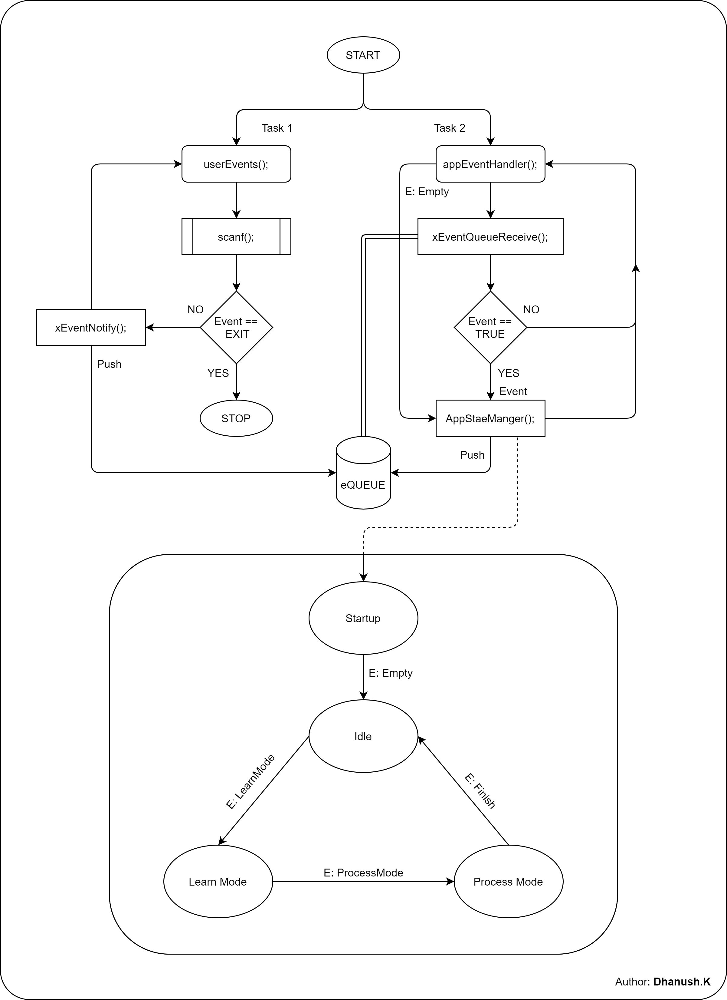

# _StateMachine_

Sample Template for Single State Machine Approach with 4-Sates and 5-Events. Event will receive from user or a internal process, based on the events State Machine will respond and change to the next state.

### States
```
    STATE_APP_STARTUP,
    STATE_APP_IDLE,
    STATE_APP_LEARN_MODE,
    STATE_APP_PROCESS_MODE,
```
### Events
```
    EVENT_EMPTY,
    EVENT_APP_LEARN_MODE,
    EVENT_APP_PROCESS_MODE,
    EVENT_APP_FINISH,
    EVENT_EXIT,
```

### Build & Run

```sh
~$: gcc -o <code dir>/stateMachine.exe app.exe

~$: <code dir>/app.exe
```

### Proces Flow
<p align="center"></p>

[**CHANGELOG**](CHANGELOG.md)

### LICENCE

[**MIT**](LICENSE)

#### Contact,

<p align="left"></p>

dhanushsandy98@gmail.com | Dhanush.K